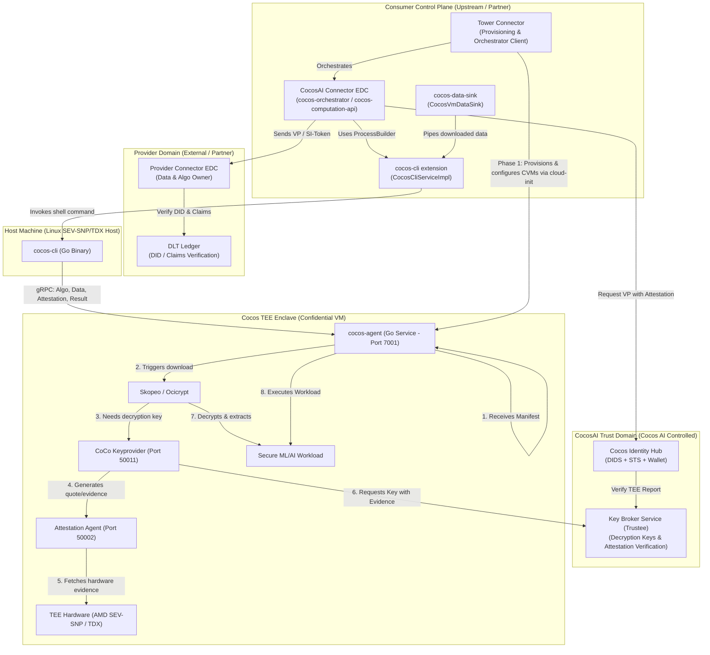
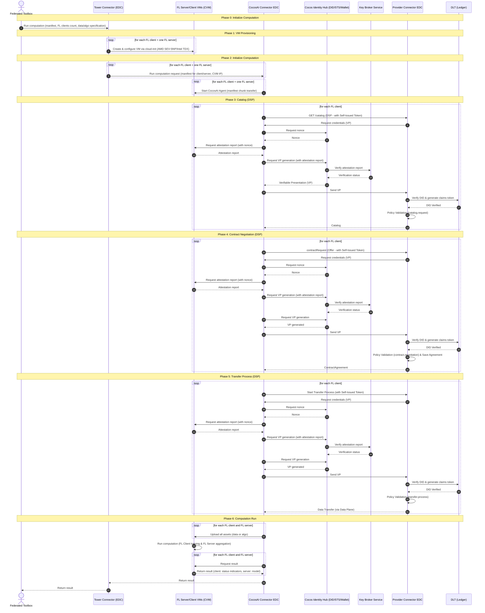

# Cocos EDC Architecture Guide

This document describes the architectural layout, component definitions, and end-to-end integration flow between **Cocos AI** (the Confidential Computing platform) and **Eclipse Dataspace Components (EDC)**.

---

## 1. System Component Architecture

The diagram below shows how the components of Cocos AI, the EDC extensions, and external trust providers interact. Since we are in charge of **Cocos AI** (`cocos-agent` and `cocos-cli`), the external/partner components (such as DLT, Provider Connectors, Identity Hubs, and VM Provisioning) can be mocked or are provided by partners.



---

## 2. End-to-End Execution Flow (UML Sequence)

The following sequence diagram models the multi-phase execution of a Federated Learning (FL) computation, showing the initialization, VM provisioning, attestation-backed DSP catalog/negotiation/transfer requests, computation, and result retrieval.



### Detailed Phase Breakdown

1. **Phase 0: Initialize Computation**:
   - The user/client starts a computation job via the **Federated Toolbox (FD)**, sending the job description, the number of clients required, and the target datasets/algorithms to the **Tower Connector (TC)**.

2. **Phase 1: VM Provisioning (Cloud-Init)**:
   - **Tower** creates the enclaves (AMD SEV-SNP or Intel TDX Confidential VMs) for each FL client and the FL server.
   - Tower configures the enclaves and the agent environment (e.g. `AGENT_CVM_GRPC_HOST` pointing to the connector, TLS CA certs) using **cloud-init** on startup.

3. **Phase 2: Initialize Agent**:
   - Tower requests the **CocosAI Connector EDC (CC_EDC)** to execute the computation.
   - The agents inside the CVMs automatically make an outbound gRPC connection (`Process` RPC) to `CC_EDC`.
   - `CC_EDC` streams the manifest (`ComputationRunReq`) in chunks to the agents.
   - Once received, the agents spin up their local gRPC servers (`AgentService` on port `7001`).

4. **Phase 3, 4, 5: DSP Catalog, Negotiation, and Transfer Process**:
   - To pull remote assets (datasets or algorithms) from Provider Connectors (`P_EDC`), `CC_EDC` conducts DSP requests.
   - At each stage, the Provider requires a Verifiable Presentation (VP) to verify enclave hardware integrity:
     - `CC_EDC` gets a nonce from the **Cocos Identity Hub (CW)**.
     - `CC_EDC` queries the CVM agent (using `cocos-cli` as a subprocess bridge) for the attestation quote containing the nonce.
     - The agent queries TEE hardware for the quote and returns it.
     - `CC_EDC` exchanges this report at `CW` for a VP, which is verified against the **Key Broker Service (KBS)**.
     - The VP is sent to `P_EDC` (which verifies it against the **DLT Ledger**), validating policies before transferring the data.

5. **Phase 6: Computation Run & Result Collection**:
   - Once datasets/algorithms are negotiated, the data plane streams them to `CocosVmDataSink`, which uploads them into the CVMs via the agent's `Data` and `Algo` gRPC endpoints.
   - The agent decrypts the OCI/generic assets (using symmetric keys from the KBS via the `Attestation Agent` / `CoCo Keyprovider`) and executes the secure training/aggregation loops inside the TEE.
   - Output results are compiled and zipped inside the enclave.
   - `CC_EDC` requests the results via `cocos-cli` (`Result` gRPC endpoint).
   - Clients return status indicators and the server returns the final aggregated model, which is forwarded back to Tower and the Federated Toolbox.

---

## 3. Component Details (Cocos AI In-Scope)

Since we are in charge of **Cocos AI**, the core components are:
* **`cocos-agent`**: Runs inside the CVM enclaves. Listens on gRPC port `7001` and implements `Algo`, `Data`, `Result`, and `Attestation` services.
* **`cocos-cli`**: A Go command-line tool wrapping gRPC commands (`data`, `algo`, `result`, `attestation get`). Integrated as a subprocess bridge inside Java.

### Excluded Components & Orchestration Roles
* **VM Provisioning**: Managed entirely by the **Tower Connector** / Tower Platform (Phase 1). Tower provisions the enclaves and configures the `cocos-agent` environment (such as gRPC host mappings, port forwarding, and TLS certificates) using **cloud-init** on startup.
* **`cocos-manager`**: Excluded from this architecture since host-level VM provisioning is decoupled from Cocos AI.
* **Identity Hubs, DLT Ledgers, and Key Broker Services**: Treated as external, mockable dependencies.

---

## 4. Current Gaps & Missing Features in Cocos AI

To keep changes minimal in `cocos-ai`, the following gaps in the current implementation are noted and should be targeted as proposed features or documented workarounds:

1. **Hardware-Attested Key Release for Non-OCI Resources**:
   - Currently, decryption keys for remote HTTP/S3 resources are retrieved via a direct HTTP GET request to the KBS (`getKeyFromKBS`).
   - *Missing Feature*: Non-OCI resource key retrieval should run through the local `Attestation Agent` to perform hardware-gated attestation verification before releasing the key.
2. **Dynamic CVM Ingress / Federated Networking**:
   - In a Federated Learning setup, FL Clients must communicate with the FL Server aggregate VM.
   - *Missing Feature*: Enclaves currently require external network configuration or public exposure. A dynamic in-enclave ingress reverse-proxy configuration is needed to route communication securely between client/server enclaves.
3. **Attestation Report Caching & Performance**:
   - During Phases 3, 4, and 5, the agent is queried repeatedly for attestation reports with different nonces.
   - *Missing Feature*: Generating TEE quotes in hardware enclaves is computationally expensive. Introducing a caching layer or session management to reuse attestation metrics while updating nonces dynamically would optimize the DSP negotiation phase.

---

## 5. User Authentication via OID4VP (Portal/UI Access)

While machine-to-machine DSP communication uses attestation-backed credential presentation (Phases 3-5), user access to portal systems (like the *TITAN Dashboard* or *EOSC Resource Hub*) utilizes a **Modified OIDC Authorization Code Flow with OID4VP** (OpenID for Verifiable Presentations), which replaces traditional username/password credentials.

### OID4VP Authentication Sequence
1. **Access & Redirect**: A participant accesses the EOSC Service (OIDC Relying Party - Mocked) using a browser, which redirects authorization to the MyAccessID (EOSC AAI Broker - Mocked) IdP Hub.
2. **IdP Selection**: The user selects the **TITAN SSI Bridge** (Keycloak + Custom Auth SPI Plugin) as the Identity Provider.
3. **Session & QR code**: The custom authenticator SPI inside the TITAN SSI Bridge creates an OID4VP session with the **UMU Verifier** (Mocked) and displays a QR code (containing `openid4vp://`) in the user's browser.
4. **Credential Presentation**: The user scans the QR code using their **UMU Wallet** (Mocked). The wallet fetches the presentation request and submits a signed `MembershipCredential` (via OID4VP) back to the UMU Verifier.
5. **Validation & Mapping**: The UMU Verifier validates the LD-Proof / JWT-VC signature, expiry, and DID. Upon success, Keycloak creates or maps user attributes from the VC claims (mapping Verifiable Presentation attributes to OIDC Token attributes) and issues a validated OIDC Token.
6. **Access Granted**: The token is returned to MyAccessID and the EOSC Service, granting the user access to the dashboard.

*Note: All components in this flow (MyAccessID, UMU Verifier, UMU Wallet, EOSC Service, and Keycloak customization) are managed by partners and remain out-of-scope/mockable for the Cocos AI team.*

---

## 6. Resource Transfer Models: Data Plane Sinks vs. In-Agent Downloads

To integrate resources negotiated via the Data Space Connector into Cocos AI CVMs, the architecture supports two distinct data transfer models. The `CocosVmDataSink` EDC extension acts as the primary integration bridge.

### Model A: Direct Upload via EDC Data Plane (DataSink-Driven)
* **How it works**:
  1. The asset (dataset or algorithm) is transferred in chunks from the Provider's EDC Data Plane directly to the Consumer's EDC Data Plane.
  2. The Consumer's Data Plane routes the stream to `CocosVmDataSink`.
  3. `CocosVmDataSink` reads the data stream and calls `cliService.uploadDataset` / `cliService.uploadAlgorithm`.
  4. Under the hood, this invokes the Go `cocos-cli` binary (`data` / `algo` command), which performs a gRPC stream upload directly into the `cocos-agent` inside the TEE.
  5. The computation manifest defines the target filename and expected cryptographic hash (SHA3-256) of the asset, but omits remote download URLs.
* **Pros**:
  - Leverages standard EDC Data Plane pipelines without needing custom enclaves network access.
  - The CVM does not need an external internet connection to fetch the asset; it only needs local connectivity to the Consumer EDC host.
* **Cons**:
  - Data transfer goes through a double-hop (Provider Storage ➔ Provider Data Plane ➔ Consumer Data Plane ➔ CVM Agent), incurring minor memory and transmission overhead.

### Model B: Agent-Side Remote Downloader (Manifest-Driven)
* **How it works**:
  1. During catalog negotiation, the EDC only transfers a data reference (e.g. OCI registry address or S3 bucket URL + KBS decryption key coordinates).
  2. The Consumer EDC short-circuits the Data Plane transfer and pushes these coordinates directly into the computation manifest (`ComputationRunReq`).
  3. The `cocos-agent` inside the TEE receives the manifest and triggers its own internal downloader client (S3/HTTP downloader or OCI pull via `Skopeo`).
  4. The agent requests decryption keys directly from the Key Broker Service (`KBS`) using local hardware attestation verification enclaves (`CoCo Keyprovider` / `Attestation Agent`).
* **Pros**:
  - Point-to-point streaming from storage to TEE enclave, maximizing performance for large datasets.
  - Decryption logic and key management are offloaded entirely to hardware enclaves.
* **Cons**:
  - Requires enclaves to have outbound internet/network access to external storage buckets and OCI registries.
  - Mandates deploying local Attestation Agent and CoCo Keyprovider sidecar services inside the TEE.

### Recommendation & Unified Integration Strategy
The **direct upload model (Model A)** is used as the default out-of-the-box pipeline, using `CocosVmDataSink` to transfer data via the `cocos-cli` subprocess bridge. This ensures maximum compatibility and strict network isolation for enclaves.

To achieve this without code modifications:
- If the manifest lists a dataset/algorithm **without** a `source` URL, the Go `cocos-agent` enters the `ReceivingAlgorithm` or `ReceivingData` state and waits for `cocos-cli` to upload the payload directly via gRPC stream.
- If the manifest contains a `source` URL and KBS is enabled, the agent automatically bypasses the direct upload listeners and downloads the asset via its own internal downloader clients.

---

## 7. Proposed Cocos Agent Modification for Data Plane Decryption (Model A + KBS)

### The Problem
Under the default **Model A (Direct Upload)**, assets are streamed to the agent via `Data()` or `Algo()` gRPC endpoints. If the provider's assets are encrypted on the storage server, the agent currently stores and uses the raw uploaded bytes directly. It does not communicate with the Key Broker Service (`KBS`) to retrieve keys or attempt decryption, which breaks key verification protocols for direct uploads.

### Proposed Code Changes in `cocos-agent`
To resolve this gap, modify `/home/sammyk/Documents/cocos-ai/agent/service.go` so that if a directly uploaded asset is marked as encrypted in the manifest, the agent retrieves the decryption key from the KBS and decrypts the payload before saving it.

#### 1. In `Algo(...)`
```go
// Add checking for manifest-based encryption config on direct uploads
if !kbsEnabled || as.computation.Algorithm.Source == nil {
    // Current fallback uses directly uploaded algorithm
    algoData = algo.Algorithm
    
    // MODIFICATION START: If the uploaded algo is configured as encrypted, decrypt it using KBS keys
    if as.computation.Algorithm.Source != nil && as.computation.Algorithm.Source.Encrypted {
        as.logger.Info("directly uploaded algorithm is encrypted, retrieving key from KBS")
        key, err := as.getKeyFromKBS(ctx, kbsURL, as.computation.Algorithm.Source.KBSResourcePath)
        if err != nil {
            return fmt.Errorf("failed to retrieve key from KBS for uploaded algorithm: %w", err)
        }
        decrypted, err := resource.DecryptData(algoData, key)
        if err != nil {
            return fmt.Errorf("failed to decrypt uploaded algorithm: %w", err)
        }
        algoData = decrypted
    }
    // MODIFICATION END
}
```

#### 2. In `Data(...)`
```go
// MODIFICATION START: Find matching dataset manifest to check if key retrieval is needed
for i, d := range as.computation.Datasets {
    if hash == d.Hash {
        # ... previous validation logic ...
        
        # Decrypt dataset bytes if encrypted
        kbsEnabled := d.KBS != nil && d.KBS.Enabled
        kbsURL := ""
        if d.KBS != nil {
            kbsURL = d.KBS.URL
        }
        if d.Source != nil && d.Source.Encrypted && kbsEnabled {
            as.logger.Info("directly uploaded dataset is encrypted, retrieving key from KBS", "filename", d.Filename)
            key, err := as.getKeyFromKBS(ctx, kbsURL, d.Source.KBSResourcePath)
            if err != nil {
                return fmt.Errorf("failed to retrieve key from KBS for dataset %s: %w", d.Filename, err)
            }
            decrypted, err := resource.DecryptData(datasetData, key)
            if err != nil {
                return fmt.Errorf("failed to decrypt dataset %s: %w", d.Filename, err)
            }
            datasetData = decrypted
        }
        
        # ... proceed with write / decompression ...
    }
}
// MODIFICATION END
```
